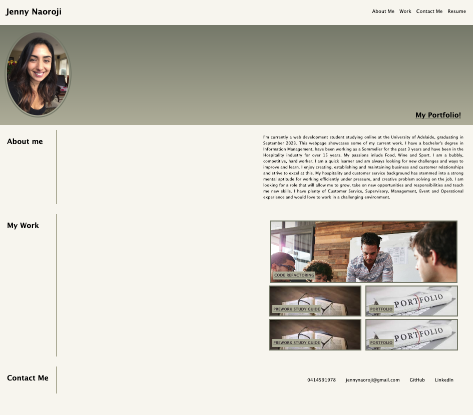

# 02 Advanced CSS: Jenny Naoroji's Portfolio

## Description

My Challenge is to create a web application from scratch! Build a portfolio page, targetted for potential employers, which showcases my strongest work. This is something I can add to as the course progresses.

## Usage

To use this website, you can review the notes in each section. Click on the links to see my work!
You can also click this link to the site: https://jnaoroji.github.io/JennyNaorojiportfolio/

## Credits

* https://developer.mozilla.org
* https://jnaoroji.github.io/code-refactor-challenge/ (image)
* https://www.dreamstime.com/blog/essential-tips-organizing-your-portfolio-51155 (image)
* https://www.google.com/imgres?imgurl=https%3A%2F%2Fcdn.pixabay.com%2Fphoto%2F2015%2F11%2F19%2F21%2F10%2Fglasses-1052010__340.jpg&tbnid=Bfo0miXoBEYRzM&vet=12ahUKEwjypZXF1_n9AhVV_jgGHejFAq4QMygWegUIARCRAg..i&imgrefurl=https%3A%2F%2Fpixabay.com%2Fimages%2Fsearch%2Fstudy%2F&docid=8uCJmeJz6qpyoM&w=453&h=340&q=study%20image&ved=2ahUKEwjypZXF1_n9AhVV_jgGHejFAq4QMygWegUIARCRAg (image)
* URL of template index.html used for this project file:///Users/jennynaoroji/bootcamp/bootcamp-repo/UADEL-VIRT-FSF-PT-03-2023-U-LOLC/02-Advanced-CSS/01-Activities/01-Ins_Media-Query-Screen/index.html 

## License

Please refer to the LICENSE in the repo.

## Screenshot

* The following shows a screenshot of My Portfolio:

